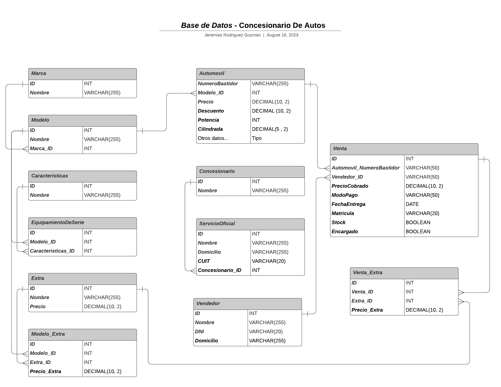

# *Base de Datos* - Concesionario de Autos

En este archivo se visualizara como estara estructurada la base de datos relacional para un concesionario de autos, en el cual remarcaremos las **entidades** con sus respectivos **atributos** y sus **relaciones.**

---
___

## Diseño de la Base de Datos
### - Entidades y Atributos:
- **Marca:**
    * ID (*Primary Key*)

    * Nombre
<br></br>

- **Modelo**
    * ID (*Primary Key*)

    * Nombre

    * Marca ID (*Foreign Key*)
<br></br>

- **Caracteristicas:**
    * ID (*Primary Key*)

    * Nombre
<br></br>

- **Equipamiento de Serie:**
    * ID (*Primary Key*)

    * Modelo ID (*Foreign Key*)

    * Caracteristicas ID (*Foreign Key*)
<br></br>

- **Extra:**
    * ID (*Primary Key*)

    * Nombre

    * Precio
<br></br>

- **Modelo Extra:**
    * ID (*Primary Key*)

    * Modelo ID (*Foreign Key*)

    * Extra ID (*Foreign Key*)

    * Precio Extra
<br></br>

- **Automovil:**
    * Numero Bastidor (*Primary Key*)

    * Modelo ID (*Foreign Key*)

    * Precio

    * Descuento

    * Potencia

    * Cilindrada

    * Etc...
<br></br>

- **Concesionario:**
    * ID (*Primary Key*)

    * Nombre
<br></br>

- **Servicio Oficial:**
    * ID (*Primary Key*)

    * Nombre

    * Domicilio

    * Cuit

    * Concesionario ID (*Foreign Key*)
<br></br>

- **Vendedor:**
    * ID (*Primary Key*)

    * Nombre

    * DNI

    * Domicilio
<br></br>

- **Venta:**
    * ID (*Primary Key*)

    * Automóvil_NumeroBastidor (*Foreign Key*) 

    * Vendedor ID (*Foreign Key*)

    * PrecioCobrado 

    * ModoPago

    * FechaEntrega

    * Matrícula

    * EsDeStock (Bool)

    * EncargadoAFábrica (Bool)
<br></br>

- **Venta_Extra:**
    * ID (*Primary Key*)

    * Venta_ID (*Foreign Key*) 

    * Extra_ID (*Foreign Key*) 

    * Precio_Extra
<br></br>

---
### - Relaciones:
* La entidad **Modelo** esta relacionada con la entidad **Marca** mediante el atributo **Marca_ID** como clave foranea e **ID** como clave primaria.

* La entidad **EquipamientoDeSerie** esta relacionada con la entidad **Modelo** mediante el atributo **Modelo_ID** como clave foranea e **ID** como clave primaria.

* La entidad **EquipamientoDeSerie** esta relacionada con la entidad **Caracteristicas** mediante el atributo **Caracteristicas_ID** como clave foranea e **ID** como clave primaria.

* La entidad **Modelo_Extra** esta relacionada con la entidad **Modelo** mediante el atributo **Modelo_ID** como clave foranea e **ID** como clave primaria.

* La entidad **Modelo_Extra** esta relacionada con la entidad **Extra** mediante el atributo **Extra_ID** como clave foranea e **ID** como clave primaria.

* La entidad **Automovil** esta relacionada con la entidad **Modelo** mediante el atributo **Modelo_ID** como clave foranea e **ID** como clave primaria.

* La entidad **ServicioOficial** esta relacionada con la entidad **Concesionario** mediante el atributo **Concesionario_ID** como clave foranea e **ID** como clave primaria.

* La entidad **Venta** esta relacionada con la entidad **Automovil** mediante el atributo **Automovil_NumeroBastidor** como clave foranea e **NumeroBastidor** como clave primaria.

* La entidad **Venta** esta relacionada con la entidad **Vendedor** mediante el atributo **Vendedor_ID** como clave foranea e **ID** como clave primaria.

* La entidad **Venta_Extra** esta relacionada con la entidad **Venta** mediante el atributo **Venta_ID** como clave foranea e **ID** como clave primaria.

* La entidad **Venta_Extra** esta relacionada con la entidad **Extra** mediante el atributo **Extra_ID** como clave foranea e **ID** como clave primaria.
<br></br>

## -  Codigo SQL:

A continuación, se presenta el código SQL que podrás ejecutar en tu gestor de bases de datos preferido para visualizar la estructura de la base de datos del concesionario de autos . Este código también está disponible en un archivo llamado **'concesionario.sql'**, ubicado en la misma carpeta **:**

```sql
-- Tabla de Modelo
CREATE TABLE Marca (
    ID INT PRIMARY KEY,
    Nombre VARCHAR(255)
);

-- Tabla de Modelo
CREATE TABLE Modelo (
    ID INT PRIMARY KEY,
    Nombre VARCHAR(255),
    Marca_ID INT,
    FOREIGN KEY (Marca_ID) REFERENCES Marca(ID)
);

-- Tabla de Caracteristicas
CREATE TABLE Caracteristicas (
    ID INT PRIMARY KEY,
    Nombre VARCHAR(255)
);

-- Tabla de Equipamiento de Serie
CREATE TABLE EquipamientoDeSerie (
    ID INT PRIMARY KEY,
    Modelo_ID INT,
    Caracteristicas_ID INT,
    FOREIGN KEY (Modelo_ID) REFERENCES Modelo(ID),
    FOREIGN KEY (Caracteristicas_ID) REFERENCES Caracteristicas(ID)
);

-- Tabla de Extra
CREATE TABLE Extra (
    ID INT PRIMARY KEY,
    Nombre VARCHAR(255),
    Precio DECIMAL(10, 2)
);

-- Tabla de Modelo Extra
CREATE TABLE Modelo_Extra (
    ID INT PRIMARY KEY,
    Modelo_ID INT,
    Extra_ID INT,
    Precio_Extra DECIMAL(10, 2),
    FOREIGN KEY (Modelo_ID) REFERENCES Modelo(ID),
    FOREIGN KEY (Extra_ID) REFERENCES Extra(ID)
);

-- Tabla de Automovi
CREATE TABLE Automovil (
    NumeroBastidor VARCHAR(255) PRIMARY KEY,
    Modelo_ID INT,
    Precio DECIMAL(10, 2),
    Descuento DECIMAL(10, 2),
    Potencia INT,
    Cilindrada DECIMAL(5, 2),
    -- Otro datos técnicos
    FOREIGN KEY (Modelo_ID) REFERENCES Modelo(ID)
);

-- Tabla de Concesionario 
CREATE TABLE Concesionario (
    ID INT PRIMARY KEY,
    Nombre VARCHAR(255)
);

-- Tabla de Servicio Oficial
CREATE TABLE ServicioOficial (
    ID INT PRIMARY KEY,
    Nombre VARCHAR(255),
    Domicilio VARCHAR(255),
    CUIT VARCHAR(20),
    Concesionario_ID INT,
    FOREIGN KEY (Concesionario_ID) REFERENCES Concesionario(ID)
);

-- Tabla de Vendedor
CREATE TABLE Vendedor (
    ID INT PRIMARY KEY,
    Nombre VARCHAR(255),
    DNI VARCHAR(20),
    Domicilio VARCHAR(255)
);

-- Tabla de Venta
CREATE TABLE Venta (
    ID INT PRIMARY KEY,
    Automovil_NumeroBastidor VARCHAR(255),
    Vendedor_ID INT,
    PrecioCobrado DECIMAL(10, 2),
    ModoPago VARCHAR(50),
    FechaEntrega DATE,
    Matricula VARCHAR(20),
    EsDeStock BOOLEAN,
    EncargadoAFabrica BOOLEAN,
    FOREIGN KEY (Automovil_NumeroBastidor) REFERENCES Automovil(NumeroBastidor),
    FOREIGN KEY (Vendedor_ID) REFERENCES Vendedor(ID)
);

-- Tabla de Venta Extra
CREATE TABLE Venta_Extra (
    ID INT PRIMARY KEY,
    Venta_ID INT,
    Extra_ID INT,
    Precio_Extra DECIMAL(10, 2),
    FOREIGN KEY (Venta_ID) REFERENCES Venta(ID),
    FOREIGN KEY (Extra_ID) REFERENCES Extra(ID)
);
```

## Diagrama de Entidad / Relacion:


<br></br>

## Enlaces / Programas Utilizados:

* Repositorio Bitbucket: https://bitbucket.org/unsta-jeremias-rodriguez-guzman/workspace/projects/BAS

* Repositorio Github: https://github.com/JereRG/Trabajo-Practico-N-1

* Programa para realizar el diagrama: **Lucidchart**

* DBMS utilizado: **SQLite**
<br></br>

## Informacion
* Nombre y Apellido: **Jeremias Rodriguez Guzman.**

* Materia: **Bases de Datos 2023.**

* Universidad: **Universidad del Norte Santo Tomas de Aquino**

*  **T.P Numero: 1 | Consigna Numero: 3**


