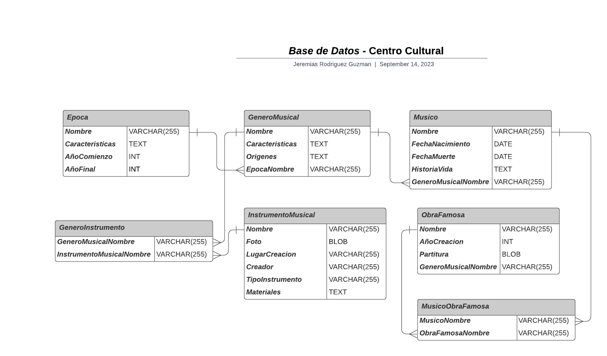

# *Base de Datos* - Centro Cultural

En este archivo se visualizara como estara estructurada la base de datos relacional para un centro cultural, en el cual remarcaremos las **entidades** con sus respectivos **atributos** y sus **relaciones.**

---
___

## Diseño de la Base de Datos
### - Entidades y Atributos:
- **Epoca:**
    * Nombre (*Primary Key*)
    * Caracteristicas
    * AñoComienzo
    * AñoFinal
<br></br>

- **GeneroMusical:**
    * Nombre (*Primary Key*)
    * Caracteristicas
    * Origenes
    * EpocaNombre (*Foreign Key*)
<br></br>

- **Musico:**
    * Nombre (*Primary Key*)
    * FechaNacimiento
    * FechaMuerte
    * HistoriaVida
    * GeneroMusicalNombre (*Foreign Key*)
<br></br>

- **InstrumentoMusical:**
    * Nombre (*Primary Key*)
    * Foto
    * LugarCreacion
    * Creador
    * TipoInstrumento
    * Materiales
<br></br>

- **GeneroInstrumento:**
    * GeneroMusicalNombre (*Primary Key , Foreign Key*)
    * InstrumentoMusicalNombre (*Primary Key , Foreign Key*)
<br></br>

- **ObraFamosa:**
    * Nombre (*Primary Key*)
    * AñoCreacion
    * Partitura
    * GeneroMusicalNombre (*Foreign Key*)
<br></br>

- **MusicoObraFamosa:**
    * MusicoNombre (*Primary Key , Foreign Key*)
    * ObraFamosaNombre (*Primary Key , Foreign Key*)
<br></br>

---
### - Relaciones:
* Una Época tiene varios Géneros Musicales.

* Un Género Musical pertenece a una única Época.

* Un Género Musical tiene varios Músicos asociados.

* Un Músico pertenece a un único Género Musical.

* Un Género Musical utiliza varios Instrumentos Musicales.

* Un Instrumento Musical se utiliza en varios Géneros Musicales.

* Una Obra Famosa pertenece a un único Género Musical.

* Varios Músicos pueden ser autores de una Obra 
Famosa.

* Un Músico puede componer varias Obras Famosas.
<br></br>

## -  Codigo SQL:

A continuación, se presenta el código SQL que podrás ejecutar en tu gestor de bases de datos preferido para visualizar la estructura de la base de datos del centro cultural . Este código también está disponible en un archivo llamado **'centro-cultural.sql'**, ubicado en la misma carpeta **:**

```sql
-- Tabla Época
CREATE TABLE Epoca (
    Nombre VARCHAR(255) PRIMARY KEY,
    Caracteristicas TEXT,
    AñoComienzo INT,
    AñoFinal INT
);

-- Tabla Género Musical
CREATE TABLE GeneroMusical (
    Nombre VARCHAR(255) PRIMARY KEY,
    Caracteristicas TEXT,
    Origenes TEXT,
    EpocaNombre VARCHAR(255),
    FOREIGN KEY (EpocaNombre) REFERENCES Epoca(Nombre)
);

-- Tabla Músico
CREATE TABLE Musico (
    Nombre VARCHAR(255) PRIMARY KEY,
    FechaNacimiento DATE,
    FechaMuerte DATE,
    HistoriaVida TEXT,
    GeneroMusicalNombre VARCHAR(255),
    FOREIGN KEY (GeneroMusicalNombre) REFERENCES GeneroMusical(Nombre)
);

-- Tabla Instrumento Musical
CREATE TABLE InstrumentoMusical (
    Nombre VARCHAR(255) PRIMARY KEY,
    Foto BLOB,
    LugarCreacion VARCHAR(255),
    Creador VARCHAR(255),
    TipoInstrumento VARCHAR(50),
    Materiales TEXT
);

-- Tabla para la relación muchos a muchos entre Género Musical e Instrumento Musical
CREATE TABLE GeneroInstrumento (
    GeneroMusicalNombre VARCHAR(255),
    InstrumentoMusicalNombre VARCHAR(255),
    PRIMARY KEY (GeneroMusicalNombre, InstrumentoMusicalNombre),
    FOREIGN KEY (GeneroMusicalNombre) REFERENCES GeneroMusical(Nombre),
    FOREIGN KEY (InstrumentoMusicalNombre) REFERENCES InstrumentoMusical(Nombre)
);

-- Tabla Obra Famosa
CREATE TABLE ObraFamosa (
    Nombre VARCHAR(255) PRIMARY KEY,
    AñoCreacion INT,
    Partitura BLOB, 
    GeneroMusicalNombre VARCHAR(255),
    FOREIGN KEY (GeneroMusicalNombre) REFERENCES GeneroMusical(Nombre)
);

-- Tabla para la relación muchos a muchos entre Músico y Obra Famosa
CREATE TABLE MusicoObraFamosa (
    MusicoNombre VARCHAR(255),
    ObraFamosaNombre VARCHAR(255),
    PRIMARY KEY (MusicoNombre, ObraFamosaNombre),
    FOREIGN KEY (MusicoNombre) REFERENCES Musico(Nombre),
    FOREIGN KEY (ObraFamosaNombre) REFERENCES ObraFamosa(Nombre)
);
```
## Diagrama de Entidad / Relacion:


<br></br>

## Enlaces / Programas Utilizados:

* Repositorio Bitbucket: https://bitbucket.org/unsta-jeremias-rodriguez-guzman/ejercicios/src/master/

* Repositorio Github: https://github.com/JereRG/base-de-datos-unsta2023

* Programa para realizar el diagrama: **Lucidchart**

* DBMS utilizado: **SQLite**
<br></br>

## Informacion
* Nombre y Apellido: **Jeremias Rodriguez Guzman.**

* Materia: **Bases de Datos 2023.**

* Universidad: **Universidad del Norte Santo Tomas de Aquino**

*  **Ejercicios | Consigna Numero: 1 | Centro Cultural**


