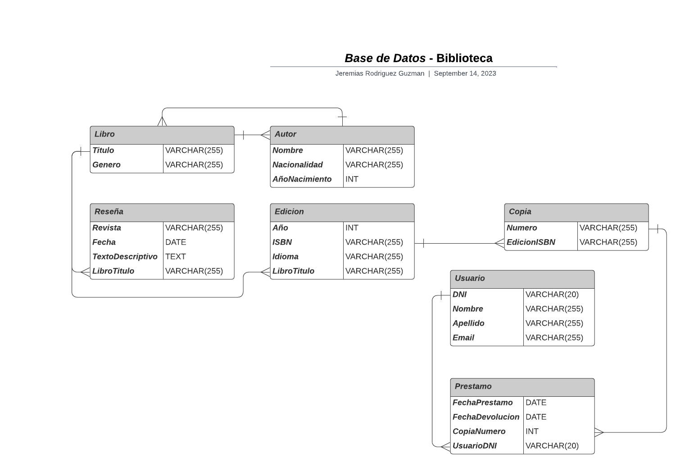

# *Base de Datos* - Biblioteca

En este archivo se visualizara como estara estructurada la base de datos relacional para una biblioteca, en el cual remarcaremos las **entidades** con sus respectivos **atributos** y sus **relaciones.**

---
___

## Diseño de la Base de Datos
### - Entidades y Atributos:
- **Libro:**
    * Titulo (*Primary Key*)
    * Genero
<br></br>

- **Autor:**
    * Nombre (*Primary Key*)
    * Nacionalidad
    * AñoNacimiento
<br></br>

- **Reseña:**
    * Revista 
    * Fecha
    * TextoDescriptivo
    * LibroTitulo (*Foreign Key*)
<br></br>

- **Edicion:**
    * Año
    * ISBN (*Primary Key*)
    * Idioma
    * LibroTitulo (*Foreign Key*)
<br></br>

- **Copia:**
    * Numero (*Primary Key*)
    * EdicionISBN (*Foreign Key*)
<br></br>

- **Usuario:**
    * DNI (*Primary Key*)
    * Nombre
    * Apellido
    * Email
<br></br>

- **Prestamo:**
    * FechaPrestamo
    * FechaDevolucion
    * CopiaNumero (*Foreign Key*)
    * UsuarioDNI (*Foreign Key*)
<br></br>

---
### - Relaciones:
* Un Libro tiene uno o varios Autores.

* Un Autor escribe uno o varios Libros.

* Un Libro puede tener varias Reseñas.

* Una Reseña pertenece a un único Libro.

* Un Libro tiene una o varias Ediciones.

* Una Edición pertenece a un único Libro.

* Una Edición tiene una o varias Copias.

* Una Copia pertenece a una única Edición.

* Una Copia puede estar asociada a varios Préstamos.

* Un Préstamo se realiza por un Usuario.

* Un Usuario puede realizar uno o varios Préstamos.
<br></br>

## -  Codigo SQL:

A continuación, se presenta el código SQL que podrás ejecutar en tu gestor de bases de datos preferido para visualizar la estructura de la base de datos de la biblioteca . Este código también está disponible en un archivo llamado **'biblioteca.sql'**, ubicado en la misma carpeta **:**

```sql
-- Tabla Libro
CREATE TABLE Libro (
    Titulo VARCHAR(255) PRIMARY KEY,
    Genero VARCHAR(255)
);

-- Tabla Autor
CREATE TABLE Autor (
    Nombre VARCHAR(255) PRIMARY KEY,
    Nacionalidad VARCHAR(255),
    AñoNacimiento INT
);

-- Tabla Reseña
CREATE TABLE Reseña (
    Revista VARCHAR(255),
    Fecha DATE,
    TextoDescriptivo TEXT,
    LibroTitulo VARCHAR(255),
    FOREIGN KEY (LibroTitulo) REFERENCES Libro(Titulo)
);

-- Tabla Edición
CREATE TABLE Edicion (
    Año INT,
    ISBN VARCHAR(255) PRIMARY KEY,
    Idioma VARCHAR(255),
    LibroTitulo VARCHAR(255),
    FOREIGN KEY (LibroTitulo) REFERENCES Libro(Titulo)
);

-- Tabla Copia
CREATE TABLE Copia (
    Numero INT PRIMARY KEY,
    EdicionISBN VARCHAR(255),
    FOREIGN KEY (EdicionISBN) REFERENCES Edicion(ISBN)
);

-- Tabla Usuario
CREATE TABLE Usuario (
    DNI VARCHAR(20) PRIMARY KEY,
    Nombre VARCHAR(255),
    Apellido VARCHAR(255),
    Email VARCHAR(255)
);

-- Tabla Préstamo
CREATE TABLE Prestamo (
    FechaPrestamo DATE,
    FechaDevolucion DATE,
    CopiaNumero INT,
    UsuarioDNI VARCHAR(20),
    PRIMARY KEY (FechaPrestamo, CopiaNumero),
    FOREIGN KEY (CopiaNumero) REFERENCES Copia(Numero),
    FOREIGN KEY (UsuarioDNI) REFERENCES Usuario(DNI)
);
```
## Diagrama de Entidad / Relacion:


<br></br>

## Enlaces / Programas Utilizados:

* Repositorio Bitbucket: https://bitbucket.org/unsta-jeremias-rodriguez-guzman/base-de-datos-unsta-2023-trabajos-practicos-ejercicios/src/master/

* Repositorio Github: https://github.com/JereRG/base-de-datos-unsta2023

* Programa para realizar el diagrama: **Lucidchart**

* DBMS utilizado: **SQLite**
<br></br>

## Informacion
* Nombre y Apellido: **Jeremias Rodriguez Guzman.**

* Materia: **Bases de Datos 2023.**

* Universidad: **Universidad del Norte Santo Tomas de Aquino**

*  **Ejercicios | Consigna Numero: 2 | Biblioteca**


