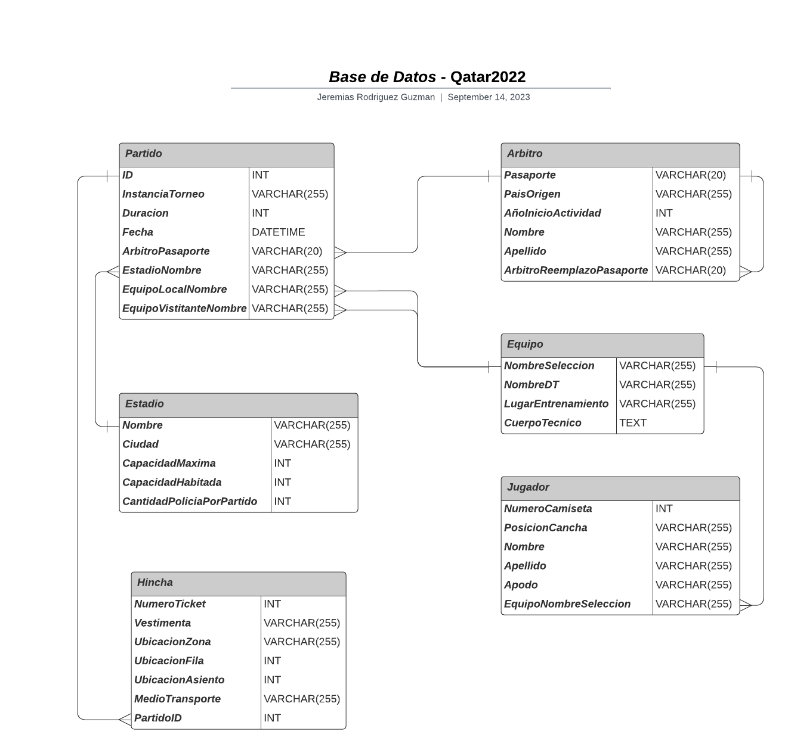

# *Base de Datos* - Centro Cultural

En este archivo se visualizara como estara estructurada la base de datos relacional para el Mundial de Qatar 2022, en el cual remarcaremos las **entidades** con sus respectivos **atributos** y sus **relaciones.**

---
___

## Diseño de la Base de Datos
### - Entidades y Atributos:
- **Partido:**
    * ID (*Primary Key*)
    * InstanciaTorneo 
    * Duracion
    * Fecha
    * ArbitroPasaporte (*Foreign Key*)
    * EstadioNombre (*Foreign Key*)
    * EquipoLocalNombre (*Foreign Key*)
    * EquipoVisitanteNombre (*Foreign Key*)
<br></br>

- **Arbitro:**
    * Pasaporte (*Primary Key*)
    * PaisOrigen
    * AñoInicioActividad
    * Nombre
    * Apellido
    * ArbitroReemplazoPasaporte (*Foreign Key*)
<br></br>

- **Equipo:**
    * NombreSeleccion (*Primary Key*)
    * NombreDT
    * NombreDT
    * CuerpoTecnico
<br></br>

- **Jugador:**
    * NumeroCamiseta
    * PosicionCancha
    * Nombre 
    * Apellido 
    * Apodo
    * EquipoNombreSeleccion (*Foreign Key*)
<br></br>

- **Estadio:**
    * Nombre (*Primary Key*)
    * Ciudad
    * CapacidadMaxima
    * CapacidadHabitada
    * CantidadPoliciaPorPartido
<br></br>

- **Hincha:**
    * NumeroTicket (*Primary Key*)
    * Vestimenta
    * UbicacionZona
    * UbicacionFila
    * UbicacionAsiento
    * MedioTransporte
    * PartidoID (*Foreign Key*)
<br></br>

---
### - Relaciones:
* Un Partido se juega en un Estadio.

* Un Estadio alberga varios Partidos.

* Un Partido involucra dos Equipos.

* Un Árbitro dirige un Partido.

* Un Árbitro de reemplazo puede reemplazar a varios Árbitros.

* Un Árbitro es de un país específico.

* Un Equipo tiene varios Jugadores.

* Un Jugador representa a un país en un Mundial.

* Varios Jugadores pueden tener el mismo número de camiseta en diferentes Equipos.

* Un Estadio recibe a varios Hinchas en cada Partido.

* Un Hincha se ubica en un Partido en un asiento específico.
<br></br>

## -  Codigo SQL:

A continuación, se presenta el código SQL que podrás ejecutar en tu gestor de bases de datos preferido para visualizar la estructura de la base de datos del mundial de qatar2022 . Este código también está disponible en un archivo llamado **'qatar2022.sql'**, ubicado en la misma carpeta **:**

```sql
-- Tabla Partido
CREATE TABLE Partido (
    ID INT PRIMARY KEY,
    InstanciaTorneo VARCHAR(255),
    Duracion INT,
    Fecha DATETIME,
    ArbitroPasaporte VARCHAR(20),
    EstadioNombre VARCHAR(255),
    EquipoLocalNombre VARCHAR(255),
    EquipoVisitanteNombre VARCHAR(255),
    FOREIGN KEY (ArbitroPasaporte) REFERENCES Arbitro(Pasaporte),
    FOREIGN KEY (EstadioNombre) REFERENCES Estadio(Nombre),
    FOREIGN KEY (EquipoLocalNombre) REFERENCES Equipo(Nombre),
    FOREIGN KEY (EquipoVisitanteNombre) REFERENCES Equipo(Nombre)
);

-- Tabla Árbitro
CREATE TABLE Arbitro (
    Pasaporte VARCHAR(20) PRIMARY KEY,
    PaisOrigen VARCHAR(255),
    AnioInicioActividad INT,
    Nombre VARCHAR(255),
    Apellido VARCHAR(255),
    ArbitroReemplazoPasaporte VARCHAR(20),
    FOREIGN KEY (ArbitroReemplazoPasaporte) REFERENCES Arbitro(Pasaporte)
);

-- Tabla Equipo
CREATE TABLE Equipo (
    NombreSeleccion VARCHAR(255) PRIMARY KEY,
    NombreDT VARCHAR(255),
    LugarEntrenamiento VARCHAR(255),
    CuerpoTecnico TEXT
);

-- Tabla Jugador
CREATE TABLE Jugador (
    NumeroCamiseta INT,
    PosicionCancha VARCHAR(255),
    Nombre VARCHAR(255),
    Apellido VARCHAR(255),
    Apodo VARCHAR(255),
    EquipoNombreSeleccion VARCHAR(255),
    FOREIGN KEY (EquipoNombreSeleccion) REFERENCES Equipo(NombreSeleccion)
);

-- Tabla Estadio
CREATE TABLE Estadio (
    Nombre VARCHAR(255) PRIMARY KEY,
    Ciudad VARCHAR(255),
    CapacidadMaxima INT,
    CapacidadHabitada INT,
    CantidadPoliciaPorPartido INT
);

-- Tabla Hincha
CREATE TABLE Hincha (
    NumeroTicket INT PRIMARY KEY,
    Vestimenta VARCHAR(255),
    UbicacionZona VARCHAR(255),
    UbicacionFila INT,
    UbicacionAsiento INT,
    MedioTransporte VARCHAR(255),
    PartidoID INT,
    FOREIGN KEY (PartidoID) REFERENCES Partido(ID)
);
```
## Diagrama de Entidad / Relacion:


<br></br>

## Enlaces / Programas Utilizados:

* Repositorio Bitbucket: https://bitbucket.org/unsta-jeremias-rodriguez-guzman/ejercicios/src/master/

* Repositorio Github: https://github.com/JereRG/base-de-datos-unsta2023

* Programa para realizar el diagrama: **Lucidchart**

* DBMS utilizado: **SQLite**
<br></br>

## Informacion
* Nombre y Apellido: **Jeremias Rodriguez Guzman.**

* Materia: **Bases de Datos 2023.**

* Universidad: **Universidad del Norte Santo Tomas de Aquino**

*  **Ejercicios | Consigna Numero: 2 | Qatar 2022**


