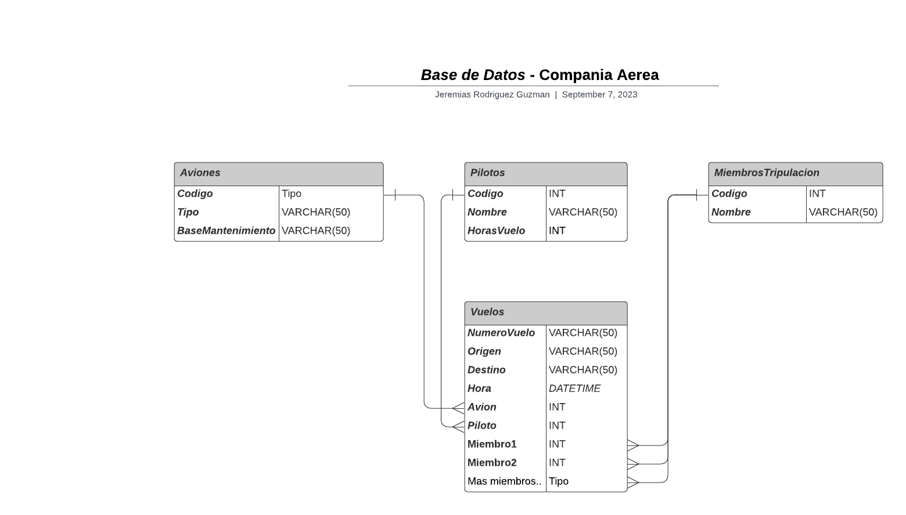

# *Base de Datos* - Compañia Aerea

En este archivo se visualizara como estara estructurada la base de datos relacional para una compañia aerea, en el cual remarcaremos las **entidades** con sus respectivos **atributos** y sus **relaciones.**

---
___

## Diseño de la Base de Datos
### - Entidades y Atributos:
- **Aviones:**
    * Codigo (*Primary Key*)
    
    * Tipo

    * Base Mantenimiento 
<br></br>

- **Pilotos:**
    * Codigo (*Primary Key*)

    * Nombre

    * Horas Vuelo
<br></br>

- **Miembros Tripulacion:**
    * Codigo (*Primary Key*)

    * Nombre
<br></br>

- **Vuelos:**
    * Numero Vuelo (*Primary Key*)
   
    * Origen 

    * Destino 

    * Hora

    * Avion (*Foreign Key*)

    * Piloto (*Foreign Key*)

    * Miembro1 (*Foreign Key*)

    * Miembro2 (*Foreign Key*)

    * Agregar mas miembros si es necesario 

    * Agregar más claves foráneas para otros miembros si es necesario
<br></br>

---
### - Relaciones:

* La entidad **Aviones** se relaciona con la entidad **Vuelos** mediante el atributo **Avion** como clave foranea y **Codigo** como clave primaria, un avion puede estar asociado a muchos vuelos, pero cada vuelo esta asociado a un solo avion.

* La entidad **Pilotos** se relaciona con la entidad **Vuelos** mediante el atributo **Piloto** como clave foranea y **Codigo** como clave primaria, un piloto puede estar asignado a varios vuelos, pero cada vuelo tiene un solo piloto.

* La entidad **MiembrosTripulacion** se relaciona con la entidad **Vuelos** mediante los atributos correspondientes a los miembros **Miembro1**, **Miembro2**, **etc**, como clave foranea y **Codigo** como clave primaria. Un miembro de tripulación puede estar asignado a varios vuelos, pero cada vuelo tiene varios miembros de tripulación.
<br></br>

## -  Codigo SQL:

A continuación, se presenta el código SQL que podrás ejecutar en tu gestor de bases de datos preferido para visualizar la estructura de la base de datos de la compañia . Este código también está disponible en un archivo llamado **'comp-aerea.sql'**, ubicado en la misma carpeta **:**

```sql
-- Tabla de Aviones
CREATE TABLE Aviones (
    Codigo INT PRIMARY KEY,
    Tipo VARCHAR(50),
    BaseMantenimiento VARCHAR(50)
);

-- Tabla de Pilotos
CREATE TABLE Pilotos (
    Codigo INT PRIMARY KEY,
    Nombre VARCHAR(100),
    HorasVuelo INT
);

-- Tabla Miembros de Tripulación
CREATE TABLE MiembrosTripulacion (
    Codigo INT PRIMARY KEY,
    Nombre VARCHAR(100)
);

-- Tabla Vuelos
CREATE TABLE Vuelos (
    NumeroVuelo VARCHAR(10) PRIMARY KEY,
    Origen VARCHAR(50),
    Destino VARCHAR(50),
    Hora DATETIME,
    Avion INT,
    Piloto INT,
    Miembro1 INT,
    Miembro2 INT,
    -- Agregar más miembros de la tripulación si es necesario
    FOREIGN KEY (Avion) REFERENCES Aviones(Codigo),
    FOREIGN KEY (Piloto) REFERENCES Pilotos(Codigo),
    FOREIGN KEY (Miembro1) REFERENCES MiembrosTripulacion(Codigo),
    FOREIGN KEY (Miembro2) REFERENCES MiembrosTripulacion(Codigo)
    -- Agregar más claves foráneas para otros miembros si es necesario
);
```

## Diagrama de Entidad / Relacion:


<br></br>

## Enlaces / Programas Utilizados:

* Repositorio Bitbucket: https://bitbucket.org/unsta-jeremias-rodriguez-guzman/workspace/projects/BAS

* Repositorio Github: https://github.com/JereRG/Trabajo-Practico-N-1

* Programa para realizar el diagrama: **Lucidchart**

* DBMS utilizado: **SQLite**
<br></br>

## Informacion
* Nombre y Apellido: **Jeremias Rodriguez Guzman.**

* Materia: **Bases de Datos 2023.**

* Universidad: **Universidad del Norte Santo Tomas de Aquino**

*  **T.P Numero: 1 | Consigna Numero: 2**
