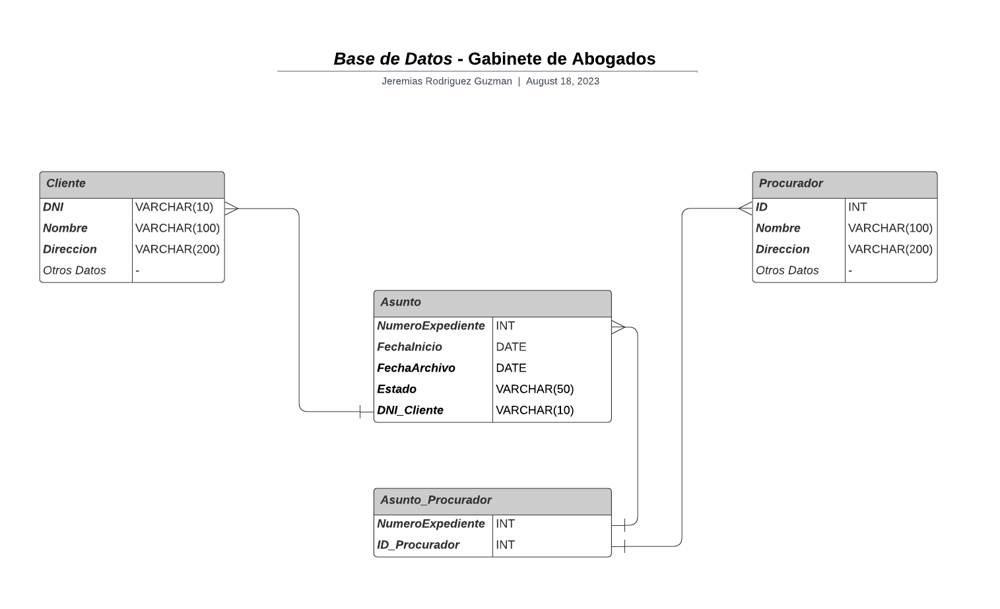

# *Base de Datos* - Gabinete de Abogados

En este archivo se visualizara como estara estructurada la base de datos relacional para un gabinete de abogados, en el cual remarcaremos las **entidades** con sus respectivos **atributos** y sus **relaciones.**

---
___

## Diseño de la Base de Datos
### - Entidades y Atributos:
- **Cliente:**
    * DNI (*Primary Key*)
    * Nombre
    * Dirección
    * Otros datos personales del Cliente
<br></br>

- **Procurador:**
    * ID (*Primary Key*)
    * Nombre
    * Direccion 
    * Otros datos personales del Procurador
<br></br>

- **Asunto:**
    * Numero Expediente (*Primary Key*)
    * Fecha Inicio
    * Fecha Archivo 
    * Estado 
    * DNI Cliente (*Foreign Key*)
<br></br>

- **Asunto_Procurador:**
    * Numero Expediente 
    * ID Procurador 
<br></br>

---
### - Relaciones:
* La entidad **Asunto** se relaciona con la entidad **Cliente** mediante el atributo **DNI** como clave foranea, ya que un asunto corresponde a un solo cliente.

* La entidad **Asunto** puede estar relacionada con uno o varios **Procurador**, y viceversa, mediante una tabla de relacion **Asunto_Procurador** que contendra el **Numero Expediente** del asunto y el **ID** del Procurador.
<br></br>


## -  Codigo SQL:

A continuación, se presenta el código SQL que podrás ejecutar en tu gestor de bases de datos preferido para visualizar la estructura de la base de datos del gabinete de abogados. Este código también está disponible en un archivo llamado **'gabinete-de-abogados.sql'**, ubicado en la misma carpeta **:**

```sql
-- Tabla Cliente
CREATE TABLE Cliente (
    DNI VARCHAR(10) PRIMARY KEY,
    Nombre VARCHAR(100),
    Direccion VARCHAR(200),
    -- Otros datos personales del cliente
);

-- Tabla Procurador
CREATE TABLE Procurador (
    ID INT PRIMARY KEY,
    Nombre VARCHAR(100),
    Direccion VARCHAR(200),
    -- Otros datos personales del procurador
);

-- Tabla Asunto
CREATE TABLE Asunto (
    NumeroExpediente INT PRIMARY KEY,
    FechaInicio DATE,
    FechaArchivo DATE,
    Estado VARCHAR(50),
    DNI_Cliente VARCHAR(10), 
    FOREIGN KEY (DNI_Cliente) REFERENCES Cliente(DNI)
);

-- Tabla de relación Asunto_Procurador
CREATE TABLE Asunto_Procurador (
    NumeroExpediente INT,
    ID_Procurador INT,
    PRIMARY KEY (NumeroExpediente, ID_Procurador),
    FOREIGN KEY (NumeroExpediente) REFERENCES Asunto(NumeroExpediente),
    FOREIGN KEY (ID_Procurador) REFERENCES Procurador(ID)
);
```
## Diagrama de Entidad / Relacion:


<br></br>

## Enlaces / Programas Utilizados:

* Repositorio Bitbucket: https://bitbucket.org/unsta-jeremias-rodriguez-guzman/base-de-datos-unsta-2023-trabajos-practicos-ejercicios/src/master/

* Repositorio Github: https://github.com/JereRG/base-de-datos-unsta2023

* Programa para realizar el diagrama: **Lucidchart**

* DBMS utilizado: **SQLite**
<br></br>

## Informacion
* Nombre y Apellido: **Jeremias Rodriguez Guzman.**

* Materia: **Bases de Datos 2023.**

* Universidad: **Universidad del Norte Santo Tomas de Aquino**

*  **T.P Numero: 1 | Consigna Numero: 1**


