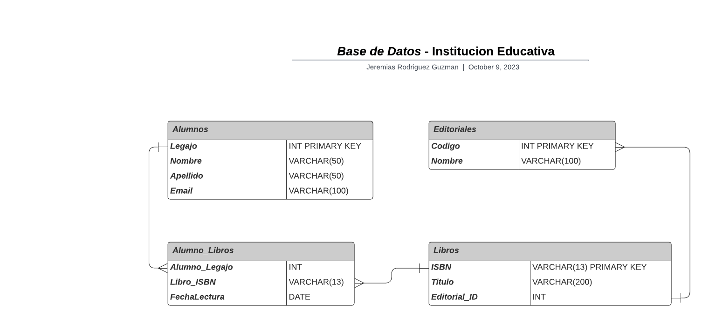

# *Base de Datos* - Gabinete de Abogados

En este archivo se visualizara como estara estructurada la base de datos relacional para una institucion educativa para registrar libros que pueden ser leidos por los alumnos, en el cual remarcaremos las **entidades** con sus respectivos **atributos** y sus **relaciones.**

---
___

## Diseño de la Base de Datos
### - Entidades y Atributos:
- **Alumnos:**
    * Legajo (*Primary Key*)
    * Nombre
    * Apellido
    * Email
<br></br>

- **Libros:**
    * ISBN (*Primary Key*)
    * Titulo
    * Editorial_ID (*Foreign Key*) 
<br></br>

- **Editoriales:**
    * Codigo (*Primary Key*)
    * Nombre
<br></br>

- **Alumno_Libros   **
    * Alumno_Legajo (*Foreign Key*)
    * Libro_ISBN (*Foreign Key*)
    * FechaLectura
<br></br>

---
### - Relaciones:
* **Alumnos:** Relación con **Alumno_Libros**: Uno a muchos (1:N) - Un alumno puede estar asociado con muchos registros en la tabla Alumno_Libro (puede leer varios libros), pero cada registro de Alumno_Libro se relaciona con un solo alumno.

* **Libros**: Relación con **Alumno_Libros**: Uno a muchos (1:N) - Un libro puede estar asociado con muchos registros en la tabla Alumno_Libro (puede ser leído por varios alumnos), pero cada registro de Alumno_Libro se relaciona con un solo libro.
Relación con **Editoriales**: Uno a uno (1:1) - Cada libro está asociado con una única editorial, y una editorial puede tener varios libros.

* **Editoriales**: Relación con **Libros**: Uno a muchos (1:N) - Una editorial puede tener varios libros, pero cada libro se relaciona con una única editorial.
<br></br>


## -  Codigo SQL:

A continuación, se presenta el código SQL que podrás ejecutar en tu gestor de bases de datos preferido para visualizar la estructura de la base de datos de la institucion educativa. Este código también está disponible en un archivo llamado **'InstEducativa.sql'**, ubicado en la misma carpeta **:**

```sql
-- Creando tabla Alumno
CREATE TABLE Alumnos (
    Legajo INT PRIMARY KEY,
    Nombre VARCHAR(50),
    Apellido VARCHAR(50),
    Email VARCHAR(100)
);

-- Creando tabla Editorial
CREATE TABLE Editoriales (
    Codigo INT PRIMARY KEY,
    Nombre VARCHAR(100)
);

-- Creando tabla Libro
CREATE TABLE Libros (
    ISBN VARCHAR(13) PRIMARY KEY,
    Título VARCHAR(200),
    Editorial_ID INT,
    FOREIGN KEY (Editorial_ID) REFERENCES Editoriales(Codigo) -- Cambio "Editorial" a "Editoriales"
);

-- Creando tabla Alumno_Libro (Tabla Intermedia)
CREATE TABLE Alumno_Libros (
    Alumno_Legajo INT,
    Libro_ISBN VARCHAR(13),
    FechaLectura DATE,
    PRIMARY KEY (Alumno_Legajo, Libro_ISBN),
    FOREIGN KEY (Alumno_Legajo) REFERENCES Alumnos(Legajo), -- Cambio "Alumno" a "Alumnos"
    FOREIGN KEY (Libro_ISBN) REFERENCES Libros(ISBN) -- Cambio "Libro" a "Libros"
);

-- Insertando datos de ejemplo en la tabla Alumno
INSERT INTO Alumnos (Legajo, Nombre, Apellido, Email)
VALUES
    (1, 'Jeremias', 'Guzman', 'jere.guzman@test.com'),
    (2, 'Marta', 'Perez', 'marta.perez@test.com'),
    (3, 'Juan', 'Rodriguez', 'juan.rod@test.com'),
    (4, 'Luis', 'Roldan', 'luis.roldan@test.com'),
    (5, 'Carlos', 'Vazquez', 'carlos.vazquez@test.com'),
    (6, 'Facundo', 'Gonzalez', 'f.gonzalez@test.com'),
    (7, 'Antonio', 'Guzman', 'anton.guzman@test.com'),
    (8, 'Luis', 'Perez', 'l.perez@test.com'),
    (9, 'Jose', 'Rodriguez', 'jose.rodriguez@test.com'),
    (10, 'Ramiro', 'Lopez', 'ram.lopez@test.com');

-- Insertando datos de ejemplo en la tabla Libro
INSERT INTO Libros (ISBN, Título, Editorial_ID)
VALUES
    ('978-1234567890', 'Libro 1', 101),
    ('978-2345678901', 'Libro 2', 102),
    ('978-3456789123', 'Libro 3', 103),
    ('978-4567891234', 'Libro 4', 104),
    ('978-5678912345', 'Libro 5', 105),
    ('978-6789123456', 'Libro 6', 106),
    ('978-7891234567', 'Libro 7', 107),
    ('978-8912345678', 'Libro 8', 108),
    ('978-9123456789', 'Libro 9', 109),
    ('978-9876543210', 'Libro 10', 110);

-- Insertando datos de ejemplo en la tabla Editorial
INSERT INTO Editoriales (Codigo, Nombre)
VALUES
    (101, 'Editorial A'),
    (102, 'Editorial B'),
    (103, 'Editorial C'),
    (104, 'Editorial D'),
    (105, 'Editorial E'),
    (106, 'Editorial F'),
    (107, 'Editorial G'),
    (108, 'Editorial H'),
    (109, 'Editorial I'),
    (110, 'Editorial J');

-- Insertando datos de ejemplo en la tabla Alumno_Libro
INSERT INTO Alumno_Libros (Alumno_Legajo, Libro_ISBN, FechaLectura)
VALUES
    (1, '978-1234567890', '2023-01-15'),
    (1, '978-2345678901', '2023-02-20'),
    (2, '978-3456789123', '2023-02-05'),
    (3, '978-4567891234', '2023-03-10'),
    (4, '978-5678912345', '2023-04-15'),
    (4, '978-6789123456', '2023-05-20'),
    (5, '978-7891234567', '2023-06-25'),
    (6, '978-8912345678', '2023-07-30'),
    (6, '978-9123456789', '2023-08-05'),
    (7, '978-9876543210', '2023-09-10');

```
## Diagrama de Entidad / Relacion:


<br></br>

## Enlaces / Programas Utilizados:

* Repositorio Github: https://github.com/JereRG/base-de-datos-unsta2023

* Programa para realizar el diagrama: **Lucidchart**

* DBMS utilizado: **PostgreSQL**
<br></br>

## Informacion
* Nombre y Apellido: **Jeremias Rodriguez Guzman.**

* Materia: **Bases de Datos 2023.**

* Universidad: **Universidad del Norte Santo Tomas de Aquino**

*  **T.P Numero: 3 | Consigna Numero: 1**


